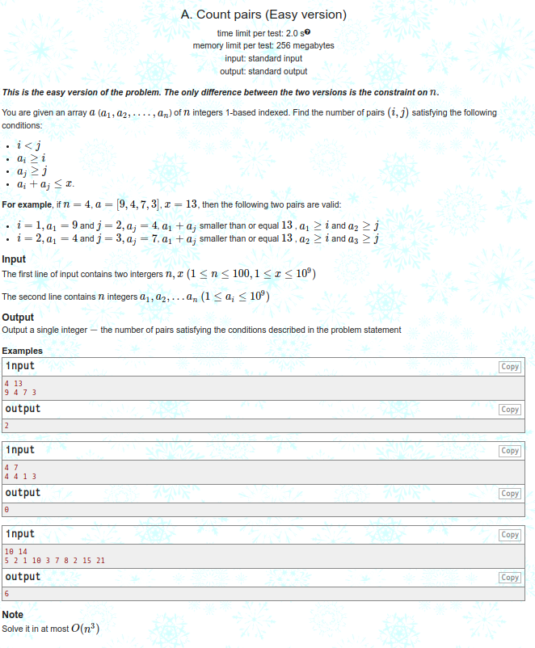

<h3 align="center"> Count Pairs Easy Version </h3>

  

<h3 align="center"> Output </h3>

  

<h3 align="center"> Code explanation </h3>

To solve this problem in `O(n^3)` time, we can use the following approach:

- Iterate over all pairs of indices (`i`, `j`) such that `i` `<` `j`.
- For each pair, check if `a[i]` `>=` `i`, `a[j]` `>=` `j`, and `a[i]` `+` `a[j]` `<=` `x`. If all of these conditions are satisfied, increment a counter.
- Return the counter as the result.
 
