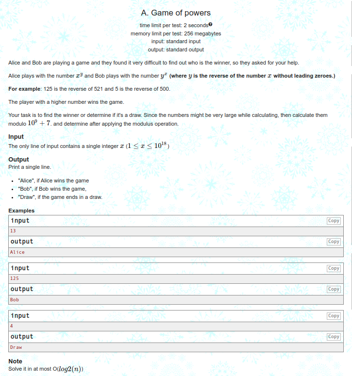
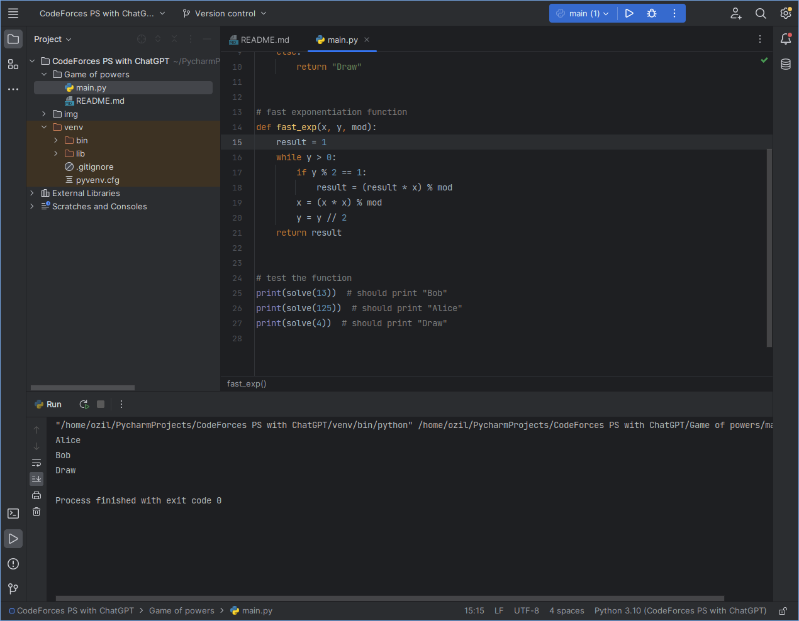

<h3 align="center"> Problem </h3>

<h3 align="center"> Output </h3>

To solve this problem, you can use the following approach:

- First, reverse the number x and store it in a variable y.
- Next, compute xy and yx modulo 109+7 using fast exponentiation.
- Finally, compare xy and yx and determine the winner or if the game is a draw.
