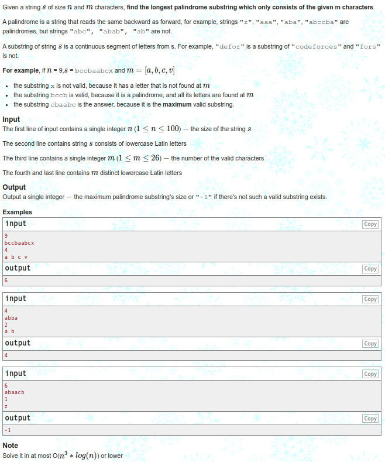
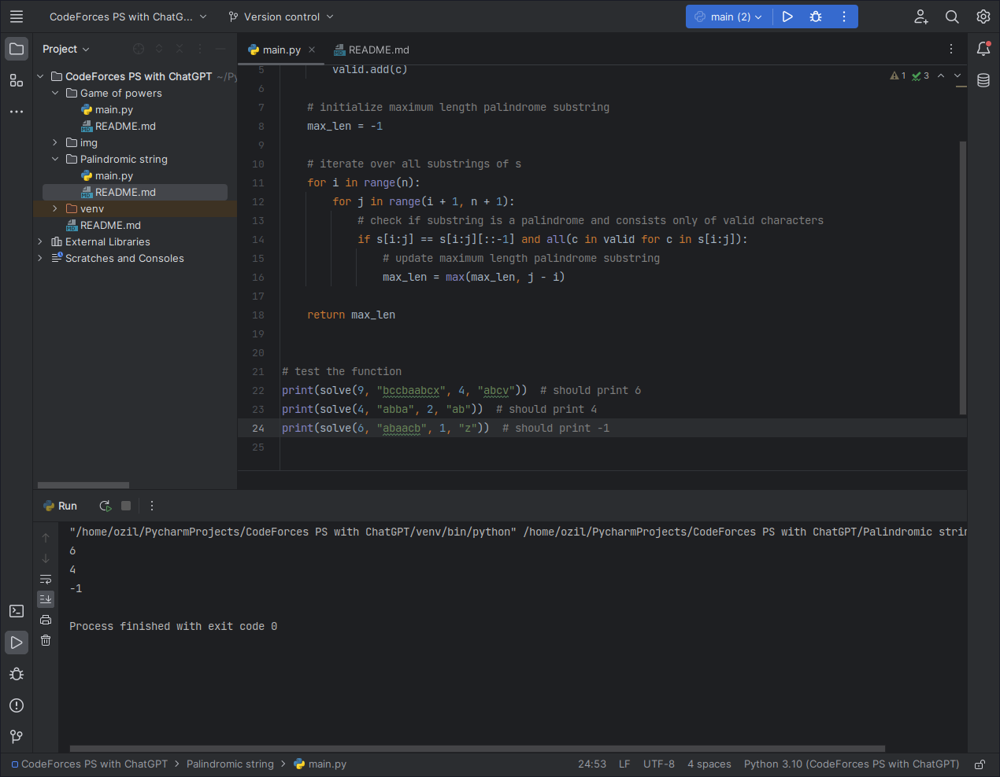

<h3 align="center"> Palindromic String </h3>

  

<h3 align="center"> Output </h3>

  

<h3 align="center"> Code explanation </h3>

To solve this problem in ` O(n^3 * log(n)) ` time or lower, we can use the following approach:

- First, we can initialize a set valid to store the `valid` characters. We can then add all the valid characters to this set for fast membership checking.
- Next, we can iterate over all substrings of `s` and check if the substring is a palindrome and consists only of valid characters. If it is, we can update the maximum length palindrome substring found so far. 
- Finally, we can return the maximum length palindrome substring found or -1 if no such substring exists.

This solution has a time complexity of ` O(n^3) ` because we are iterating over all substrings of `s`, which takes ` O(n^2) ` time, and checking if the substring is a palindrome and consists only of valid characters, which takes ` O(n) ` time. The set
membership check takes ` O(1) ` time, so the overall time complexity is ` O(n^3)`. However, if we use a more efficient algorithm for checking if a string is a palindrome, such as Manacher's algorithm, the time complexity can be reduced to ` O(n^2 * log(n))` .

